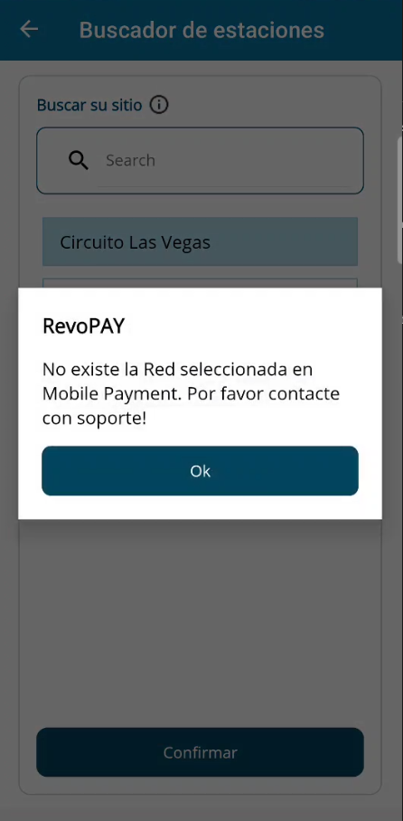
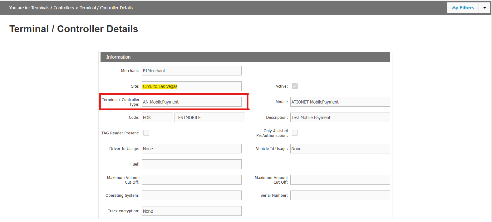

 
# RevoPAY Technician App

<!--  logo turns out being a little to big -->

|Document Information||
|--- |--- |
|Archivo:|ATIONet - RevoPAY Technician|
|Doc Version:|1.0|
|Date:|03-09-2025|
|Author:|Joaquín Miguens|

|Change Control |||
|--- |--- |--- |
|Ver.|Date|Changes|
|1.0|03-09-2025|Initial version.|

## Content
 - [Objective](#objective)
 - [Pre-Requisites](#pre-requisites)
    - [Ationet Configuration](#ationet-configuration)
    - [MobilePayment Configuration](#mobilepayment-configuration)
 - [How to use RevoPAY Technician](#how-to-use-revopay-technician)

### Objective

The main objective of RevoPAY Technician, is to allow an easy configuration for RevoPAY. In just a few minutes after arrival, the technician can connect via BLE (Bluetooth Low Energy) to RevoPAY and make every configuration needed in order to have it up and running, ready to go. Besides, it facilitates extra configuration in MobilePayment, such as creating an existing site in Ationet inside MobilePayment, and its corresponding credentials. 

### Pre-Requisites
* This entity is a software application embedded in a Mobile Device or downloaded by a consumer onto a Mobile Device, such as a smartphone or tablet. Supports both Android and iOS devices.

* An existing user with the NWTechnician role in Ationet.

* An existing network in MobilePayment with the exact same NetworkCode (XYZ) as in Ationet.

* A RevoPAY plugged on and near in order to have a successful Bluetooth communication.

* An existing site in Ationet with an active AN-MobilePayment terminal associated.

## Ationet Configuration 
- [NWTechnician Role](#ationet-configuration-for-revopay-technician)
- [Site with AN-MobilePayment associated terminal](#site-with-an-mobilepayment-associated-terminal)

## MobilePayment Configuration

- [Network Configuration](#network-configuration-for-revopay-technician) 
- [How to create a Network in MobilePayment](#how-to-create-a-network-in-mobilepayment) 

 

## How to use RevoPAY Technician

Once you have an existing user with the NWTechnician role and the Network is created in MobilePayment, you are ready to go.
This guide will explain the different actions available inside the app and how to use them.

 - [Login](#app-login)
    - [Device Authentication Methods](#device-authentication-methods)
    - [Forgot password?](#forgot-password)
    - [Entity Selector](#entity-selector)   
    - [Site Selector](#site-selector) 
 - [HomeView](#homeview)
    - [LogOut](#logout)
    - [Settings](#settings)
    - [Change Site](#site-selector)
    - [RevoPAY](#revopay)
        - [Bluetooth Scanner](#bluetooth-scanner)
        - [General Menu](#revopay-general-menu)
        - [Wifi Configuration](#wifi-configuration-for-revopay)
        - [Appsettings Configuration](#appsettings-configuration-for-revopay)

 

 

    

## Network Configuration For RevoPAY Technician

Once you log in RevoPAY Technician, an Entity Selector will be shown. If the user only has one associated network in Ationet, it will automatically select it, otherwise, it will ask the technician to pick which Network he will be working with. This step is needed in order to show the technician the corresponding sites for the selected Network. 

### Conditions

As mentioned, in order to move forward with the configuration for RevoPAY, the technician must select an entity. After it is selected, it will validate the network's existence in MobilePayment. In order for this condition to be satisfied, there must be one network with the same CODE in both Ationet and MobilePayment. If it shares the Code, then it will be considered as the SAME Network by RevoPAY Technician.

### Inexistent MobilePayment Network

In case the Network does not exist in MobilePayment, RevoPAY Technician will display an error message indicating that the network is inexistant in MobilePayment, and that in order to proceed, it must first be created. This is the reason creating the Network in MobilePayment is a requisite.

 

## How to create a Network in MobilePayment

Steps :

 * Log in the MobilePayment https://ationetmobilepayment-appshostportal.azurewebsites.net/Login
    
 * Go to the Networks module
      
 * Press the Create Network button 

 * Fill the information as needed (remind to use the exact same code as in Ationet, we recommend to complete the Name and Currency just the same way for clearance)
       

 * Validate the Network was created Succesfully and it is enabled (if it is disabled, remember to enable it)!

     
     

 

## Ationet Configuration For RevoPAY Technician
### NWTechnician Role Configuration

 
In order to log in RevoPAY Technician successfully, it needs a user with the specific role of NWTechnician. 
If the introduced user doesn't have that role, it won't be able to log in. 

NWTechnician supports several networks, therefore, the same technician may be able to configure several sites, from several entities. The role only has access to the Sites, Terminals and Notifications menu, as they are the only modules the app will need.

And once the user is ready, you can now log in RevoPAY Technician!

 

 

## Site with AN-MobilePayment associated terminal

Once you have already logged with a NWTechnician user, you will be asked to select which site to configure. The shown list will ONLY show sites that belong to the selected entity and, most importantly, among those sites, ONLY the ones that have an ACTIVE AN-MobilePayment terminal associated.

If the sites display does not show your site, then please check the following validations.

* The site exists in Ationet (Check in Ationet's Sites module).
* The site has an associated AN-MobilePayment terminal (Check in Ationet's Terminals module).
* The AN-MobilePayment terminal is active.

 

### Once this conditions are satisfied, Technician's site selector will display your Site!

 

## App Login

    
    
    

 

When you first open the app, it will ask for a username and a password. This must be the ones of a NWTechnician user in Ationet, otherwise it won't log in. Neither the user field nor the password field can be empty, and the user must have a valid mail format. After pressing Log In, if the user and password are valid, the technician will be asked to select an entity!

 

### Device Authentication Methods

  

  

    If the Remember Session checkbox is <strong>checked</strong> and afterwards, you login correctly, next time you enter the app, instead of completing the user/password fields, they will already be filled with the last completed information. Besides, if your device has any Authentication method active, such as PIN, Pattern, Fingerprint or Facial recognition, it will ask you to authenticate.    
    If you have more that one Authentication method active, you will be able to choose which one to use! 
    After authenticating, you will automatically log in!
  

 

### Forgot password

Will ask you to complete your user's mail. Once validated, check your mailbox for how to reset it!

 

### Entity Selector

Here the technician will be asked to select which network to work on. The list only shows the networks associated to the user in Ationet, not in MobilePayment. In case the user only has one network associated, it will automatically select it. Otherwise, the technician must indicate which one.

    
    

 

### Site Selector

After selecting the Entity, it will show a Sites display view, where the technician will be able to select which site he is working on.
The display will ONLY show the sites belonging to the selected Network that have an ACTIVE AN-MobilePayment type terminal associated. Otherwise, either the terminal is inactive, or the terminal isn't an AN-MobilePayment one, or the terminal is not associated to the site, then, the site won't appear on the list. 

Once you find your site (there is a filter to search for Site Name) and confirm, there are three scenarios.

 - The site doesn't exit in MobilePayment.
 - The site exists in MobilePayment in the selected Network, and satisfies the Code conditions for RevoPAY.
 - The site exists in MobilePayment and satisfies the Code conditions for RevoPAY, but belongs to another network.

Keep in mind that it filters among the MobilePayment sites via SiteCode. Also, the Network's existance validation will only occurr after selecting an Ationet Site.

 
 
## The site doesn't exit in MobilePayment

In this case, the app will show you a Site Creation view, where the technician will be able to see the site information and confirm its creation.
It will also create new credentials, with the following format :  
- User : Admin{SiteCode} 
- Pass : Admin{SiteCode}  
    Where the Site Code will be in lowercase and without blank spaces, as it is one condition for RevoPAY to work correctly! 

    
    
    

 

## The site exists in MobilePayment in the selected Network, and satisfies the Code conditions for RevoPAY

In this case, only a simple "Site Selected. Credentials renewed" message display will be shown.
It will renew credentials just like in creation : 
    - User : Admin{SiteCode} 
    - Pass : Pass{SiteCode}     

 

## The site doesn't exist in MobilePayment and satisfies the Code conditions for RevoPAY, but exists for another network.

Due to how RevoPAY functions, it does not allow having two sites with the same code, independently from the Network. Therefore, it won't allow to create a Site with the same code as an already existing one, belonging to another network, as that would result in neither of the sites working correctly with RevoPAY. In this case, it is recommended to change the Site Code in Ationet. Remember Site Codes in mobile payment will be in lowercase, without blank spaces, and no special characters! 

If this scenario is reached, the app will show it with the following display message : 

 

## HomeView

  

  

    In the <strong>HomeView</strong> page, you will find different options. 
    In the Top bar, you can see the version number of the app, a Settings button and a LogOut button.  
    Then, there are two main menus.  
    Change Site, which will allow the technician to pick a different site from the same already selected Network!  
    RevoPAY, which takes the technician to a Bluetooth Scanner in order to connect with the RevoPAY and make any necessary configuration!
  

 

### LogOut
The LogOut button will take you back to the Login view, and forget both the user used to log in, and the authentication methods of your device! 

 

 

### Settings

    
    
    
    

 

In the HomeView > Settings Menu, you are able to see the Entity you selected, as well as both the Ationet Site, and the MobilePayment Site with the following format : Code(Name).

Apart from that, you have two options

 * Change Password, which will take you to a page to create a new one. 
 * Change Entity, which will take you back to the Entity Selector if your user has more than one entity to select from. Otherwise, it will show a     message indicating you only have one available entity.

 

## RevoPAY

  

  

    Up to this point, every configuration done is directly related to Ationet or MobilePayment. Networks, Sites, Credentials, etc.  
    RevoPAY's Module is intended for the technician to actually configure a new or an already installed RevoPAY.  
    Only two things are needed.  
    1) RevoPAY must be plugged in. 
    2) The technician must be near the RevoPAY in order to establish a good Bluetooth communication.    
     Otherwise, it will fail to connect or to send/receive information.
  

 

### Bluetooth Scanner

  

  

    Once you go in the RevoPAY module, you will find a Bluetooth Scanner. After pressing Scan Devices, you will need to allow the app certain bluetooth related permissions for the scanner to work.   
    After a few seconds, it should be able to detect the RevoPAY near you. If it doesn't show up, please try going back and scanning again, and if that fails too, restart the RevoPAY (Unplug and plug it again).  To connect, simply select the RevoPAY!
  

 

## RevoPAY General Menu

  

  

    After establishing connection with RevoPAY, the technician will be redirected to a General Configuration Menu for RevoPAY, where you can access to main options :  
    <strong>Wifi Configuration</strong>  
    Where the technician will be able to check if RevoPAY has wifi connection, and if it doesn't, connect it to a Wifi Network.
      
    <strong>Appsetting's Configuration</strong>  
    Where the technician will be able to modify RevoPAY's appsettings file as needed!
  

 

 

## Wifi Configuration for RevoPAY

    
    
    

 
In the Wifi Module for RevoPAY, there is an LED-type button indicating if it has connection (red = NO CONNECTION / green = CONNECTED)
And one list showing all available wifi networks RevoPAY can access to. Select one, put the password, connect, wait a few seconds, and done! The connection should be established.   If after a while it doesn't connect, please try again and check the inputted password.  

 

## Appsettings Configuration for RevoPAY

    
    
    

 
In the Appsettings view you will be able to configure everything you need. URL, SiteSystem, Credentials, etc.
You <strong>WON'T</strong> be able to change the SiteCode or the NetworkCode, as these are taken from the past selections.  If you need to change it, either go to HomeView>Settings>Change Entity for the NetworkCode, or to HomeView>Change Site for the SiteCode.
  
MPPAHost Credentials on the other hand, are configurable. We recommend using the generic credentials, which are assured to be valid! 
Remember : Admin{SiteCode}, Pass{SiteCode}
  
There is an LED-Type button which indicates if the MPPAClient service is running. Not if RevoPAY is working correctly, only if the service is running.
 
There is also an advanced option button, which enables certain other fields to be completed, such as timeouts or blob-configuration.
  
On the SiteSystem Configuration menu, you will be able to select which SiteSystem type to use, such as PTS-2 or Nano-CPI.
 
Each of these options will display the extra needed configuration accordingly.
 
 
Finally, a Send Configuration button, which will update the MPPAClient service's appsetting via Bluetooth as configured by the technician!

 

*End of Document*
