 
# RevoPAY Technician App

|Document Information||
|--- |--- |
|Archivo:|ATIONet - RevoPAY Technician|
|Doc Version:|1.0|
|Date:|03-09-2025|
|Author:|Joaquín Miguens|

|Change Control |||
|--- |--- |--- |
|Ver.|Date|Changes|
|1.0|03-09-2025|Versión inicial.|

## Contenido

- [Objetivo](#objetivo)
- [Pre-Requisitos](#pre-requisitos)
    - [Configuración en Ationet](#configuración-en-ationet)
    - [Configuración de MobilePayment](#configuración-de-mobilepayment)
- [Cómo usar RevoPAY Technician](#cómo-usar-revopay-technician)

### Objetivo

El principal objetivo de RevoPAY Technician es permitir una configuración sencilla para RevoPAY. En solo unos minutos después de su llegada, el técnico puede conectarse a través de **BLE** (Bluetooth Low Energy) a RevoPAY y realizar todas las configuraciones necesarias para que esté en funcionamiento y listo para usar. Además, facilita una configuración extra en MobilePayment, como la creación de un sitio existente en Ationet dentro de MobilePayment y sus correspondientes credenciales.

### Pre-Requisitos

  * Esta entidad es una aplicación de software incrustada en un dispositivo móvil o descargada por un consumidor en un dispositivo móvil, como un smartphone o una tablet. Compatible con dispositivos Android e iOS.

  * Un usuario existente con el rol **NWTechnician** en Ationet.

  * Una red existente en MobilePayment con el mismo Código de Red (XYZ) exacto que en Ationet.

  * Un RevoPAY enchufado y cerca para tener una comunicación Bluetooth exitosa.

  * Un sitio existente en Ationet con una terminal **AN-MobilePayment** activo asociado.

## Configuración en Ationet

  - [Rol NWTechnician](#configuración-de-ationet-para-revopay-technician)
  - [Sitio con una terminal AN-MobilePayment asociado](#sitio-con-una-terminal-an-mobilepayment-asociada)

## Configuración de MobilePayment

  - [Configuración de Red](#configuración-de-red-para-revopay-technician)
  - [Cómo crear una Red en MobilePayment](#cómo-crear-una-red-en-mobilepayment)

 

## Cómo usar RevoPAY Technician

Una vez que tengas un usuario existente con el rol **NWTechnician** y la Red haya sido creada en MobilePayment, estás listo para comenzar. Esta guía explicará las diferentes acciones disponibles dentro de la aplicación y cómo usarlas.

- [Login](#login)
    - [Métodos de autenticación del dispositivo](#métodos-de-autenticación-del-dispositivo)
    - [¿Olvidaste tu contraseña?](#olvidaste-tu-contraseña)
    - [Selector de Entidad](#selector-de-entidad)  
    - [Selector de Sitio](#selector-de-sitio)
- [HomeView](#homeview)
    - [Cerrar sesión](#cerrar-sesión)
    - [Ajustes](#ajustes)
    - [Cambiar sitio](#selector-de-sitio)
    - [RevoPAY](#revopay)
        - [Escáner Bluetooth](#escáner-bluetooth)
        - [Menú General](#menú-general-de-revopay)
        - [Configuración de Wifi](#configuración-de-wifi-para-revopay)
        - [Configuración de Appsettings](#configuración-de-appsettings-para-revopay)

 

 

## Configuración de Red para RevoPAY Technician

Una vez que inicies sesión en RevoPAY Technician, se mostrará un selector de entidad. Si el usuario solo tiene una red asociada en Ationet, la seleccionará automáticamente; de lo contrario, le pedirá al técnico que elija con qué Red trabajará. Este paso es necesario para mostrar al técnico los sitios correspondientes para la Red seleccionada.

### Condiciones

Como se mencionó, para avanzar con la configuración de RevoPAY, el técnico debe seleccionar una entidad. Después de seleccionarla, se validará la existencia de la red en MobilePayment. Para que esta condición se cumpla, debe haber una red con el mismo **Código** tanto en Ationet como en MobilePayment. Si comparten el Código, RevoPAY Technician la considerará como la **MISMA Red**.

### Red inexistente en MobilePayment

En caso de que la Red no exista en MobilePayment, RevoPAY Technician mostrará un mensaje de error que indica que la red es inexistente en MobilePayment y que, para continuar, primero debe ser creada. Por esta razón, crear la Red en MobilePayment es un requisito.

 

## Cómo crear una Red en MobilePayment

Pasos:

* Inicia sesión en MobilePayment: https://ationetmobilepayment-appshostportal.azurewebsites.net/Login
   
* Ve al módulo **Networks/Redes**
      
* Haz clic en el botón **Crear Red**

* Completa la información según sea necesario (recorda usar el mismo **Código** exacto que en Ationet; recomendamos que el Nombre y la Moneda sean iguales para mayor claridad)
       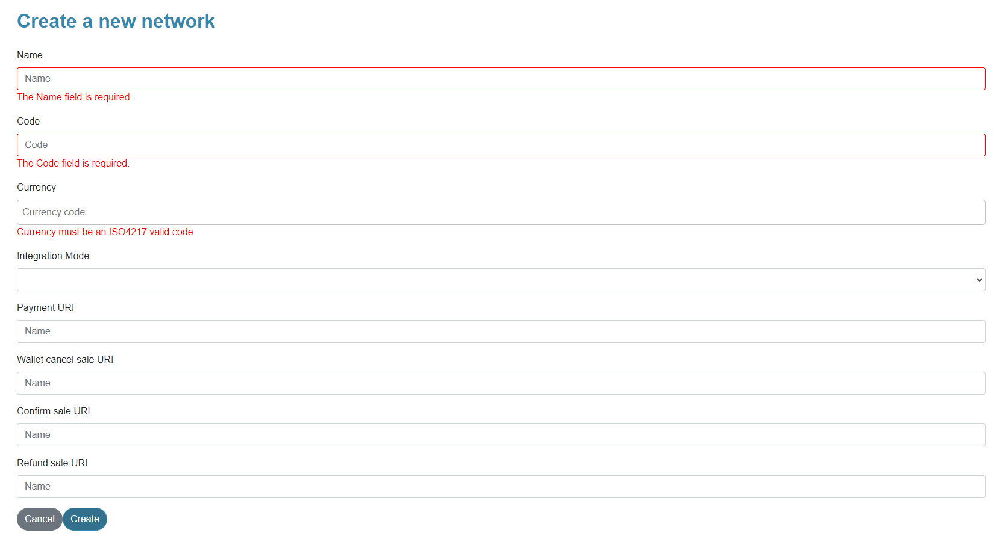

* ¡Valida que la Red se haya creado con éxito y esté habilitada (si está deshabilitada, recordá habilitarla)!

     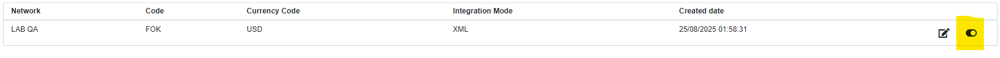
     

 

## Configuración de Ationet para RevoPAY Technician

### Configuración del Rol NWTechnician

    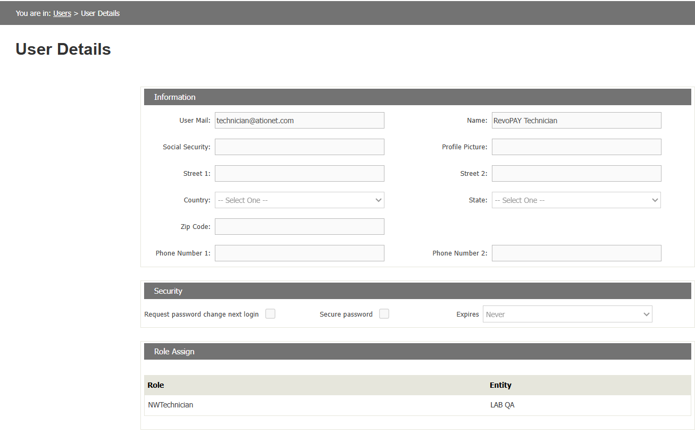
    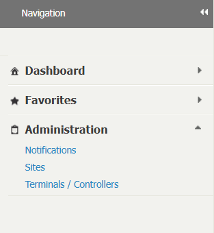

 

Para iniciar sesión en RevoPAY Technician con éxito, se necesita un usuario con el rol específico de **NWTechnician**. Si el usuario introducido no tiene ese rol, no podrá iniciar sesión.

**NWTechnician** soporta varias redes, por lo tanto, el mismo técnico puede configurar varios sitios de varias entidades. El rol solo tiene acceso a los modulos de Sitios, Terminales y Notificaciones ya que son los únicos módulos que la aplicación necesitará.

Y una vez que el usuario esté listo, ¡ya podes iniciar sesión en RevoPAY Technician!

 
 

## Sitio con una terminal AN-MobilePayment asociada

Una vez que hayas iniciado sesión con un usuario **NWTechnician**, se te pedirá que selecciones el sitio a configurar. La lista  **SOLO** mostrará los sitios que pertenecen a la entidad seleccionada y, lo más importante, de esos sitios, **SOLO** los que tienen una terminal de tipo **AN-MobilePayment** activa asociada.

Si la pantalla de sitios no muestra el tuyo, verifica los siguiente:

  * El sitio existe en Ationet (revisar en el módulo **Sitios** de Ationet).
  * El sitio tiene una terminal de tipo **AN-MobilePayment** asociado (verifica en el módulo **Terminales** de Ationet).
  * La terminal **AN-MobilePayment** está activa.

### Una vez que estas condiciones se cumplan, el selector de sitios de Technician mostrará tu Sitio!

 

## Login

    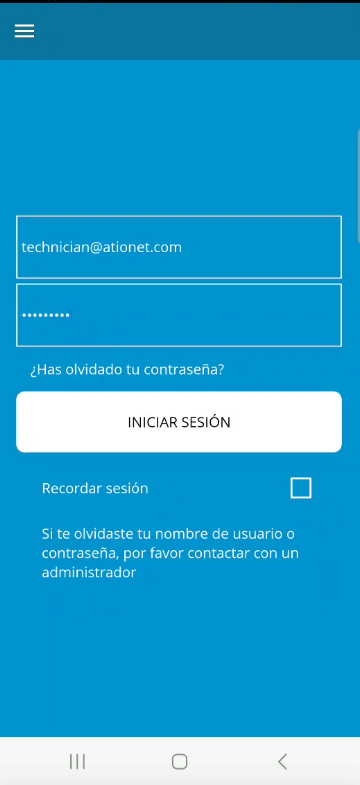
    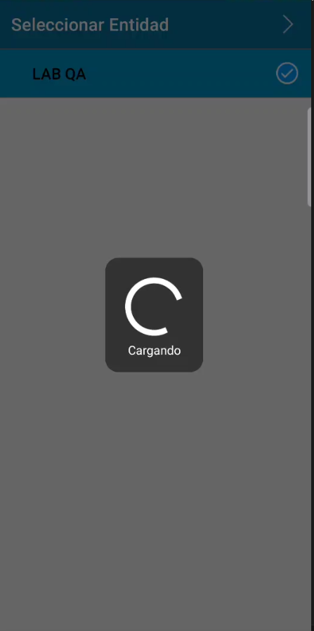
    

 

Cuando abras la aplicación por primera vez, te pedirá un nombre de usuario y una contraseña. Estos deben ser los de un usuario **NWTechnician** en Ationet, de lo contrario no iniciará sesión. El campo de usuario y el de contraseña no pueden estar vacíos, y el usuario debe tener un formato de correo válido. Después de presionar **Ingresar**, si el usuario y la contraseña son válidos, se le pedirá al técnico que seleccione una entidad.

 

### Métodos de autenticación del dispositivo

  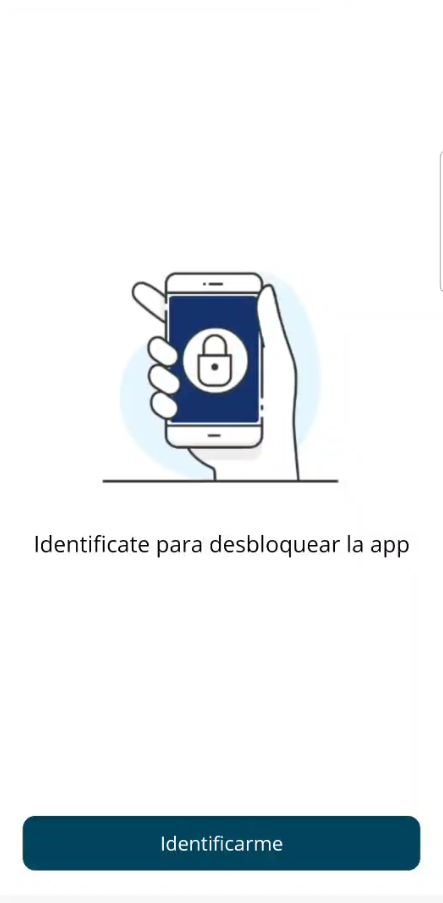

  

Si la casilla **Recordar sesión** está **marcada** y luego inicias sesión correctamente, la próxima vez que entres en la aplicación, en lugar de completar los campos de usuario/contraseña, estos ya estarán llenos con la última información utilizada. Además, si tu dispositivo tiene algún método de autenticación activo, como PIN, patrón, huella digital o reconocimiento facial, te pedirá que te autentiques.   
Si tienes más de un método de autenticación activo, se puede elegir cuál usar! Después de autenticarte, iniciarás sesión automáticamente.
  

 

### Olvidaste tu contraseña?

Te pedirá que completes el correo de tu usuario. Una vez validado, revisa tu correo para saber cómo restablecerla!

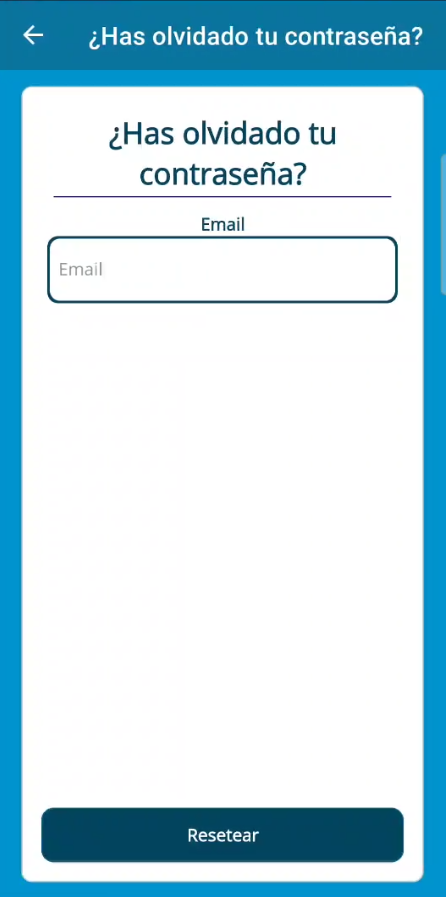

 

### Selector de entidad

Aquí se le pedirá al técnico que seleccione en qué red trabajar. La lista solo muestra las redes asociadas al usuario en Ationet, no en MobilePayment.  En caso de que el usuario solo tenga una red asociada, la seleccionará automáticamente. De lo contrario, el técnico debe indicar cuál.

    
    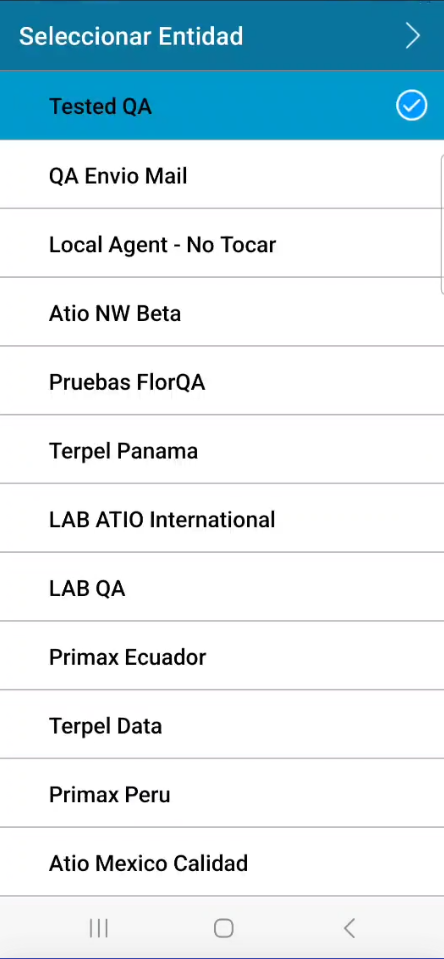

 

### Selector de sitio

Después de seleccionar la entidad, se mostrará una vista de sitios, donde el técnico podrá seleccionar en qué sitio está trabajando.   La pantalla **SOLO** mostrará los sitios que pertenecen a la Red seleccionada y que tienen una terminal de tipo **AN-MobilePayment** activa asociada.  De lo contrario, si la terminal está inactiva, si no es una terminal **AN-MobilePayment** o si no está asociada al sitio, este no aparecerá en la lista.

Una vez que encuentres tu sitio (hay un filtro para buscar por **Nombre**) y confirmes, hay tres posibles escenarios.

- El sitio no existe en MobilePayment. 
- El sitio existe en MobilePayment en la Red seleccionada y cumple con las condiciones de código para RevoPAY. 
- El sitio existe en MobilePayment y cumple con las condiciones de código para RevoPAY, pero pertenece a otra Red. 

Ten en cuenta que filtra entre los sitios de MobilePayment a través del Código de Sitio. Además, la validación de la existencia de la Red solo ocurrirá después de seleccionar un sitio de Ationet.

 

## El sitio no existe en MobilePayment

En este caso, la aplicación te mostrará una vista de creación de sitio, donde el técnico podrá ver la información del sitio y confirmar su creación. También creará nuevas credenciales, con el siguiente formato: 
- Usuario: Admin{CódigoDeSitio} 
- Contraseña: Admin{CódigoDeSitio}  
Donde el **Código de sitio** estará en minúsculas y sin espacios en blanco, ya que es una condición para que RevoPAY funcione correctamente.

    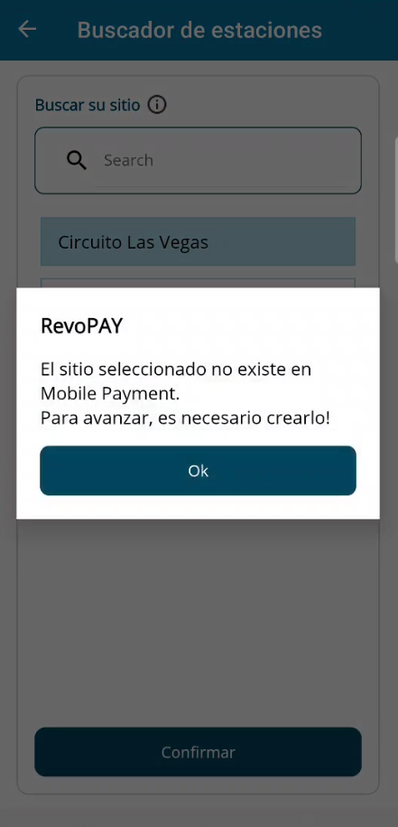
    
    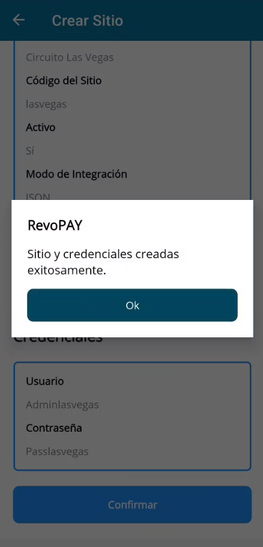

 

## El sitio existe en MobilePayment en la Red seleccionada y cumple con las condiciones de Código para RevoPAY

En este caso, solo se mostrará un simple mensaje "Sitio seleccionado. Credenciales Renovadas".
Tambien va a renovar las credenciales, de la misma forma que al crear :  
- Usuario: Admin{CódigoDeSitio} 
- Contraseña: Admin{CódigoDeSitio}  

 

## El sitio no existe en MobilePayment y cumple con las condiciones de Código para RevoPAY, pero existe en otra Red

Debido a cómo funciona RevoPAY, no permite tener dos sitios con el mismo código, independientemente de la Red. Por lo tanto, no permitirá crear un sitio con el mismo código que uno ya existente que pertenece a otra red, ya que eso resultaría en que ninguno de los sitios funcione correctamente con RevoPAY. En este caso, se recomienda cambiar el **Código de sitio** en Ationet. Recordá que los códigos de sitios en MobilePayment deben estar en minúsculas, sin espacios en blanco y sin caracteres especiales!

Si se llega a este escenario, la aplicación lo mostrará con el siguiente mensaje:

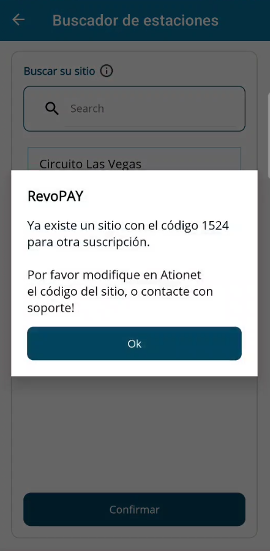

 

## HomeView

  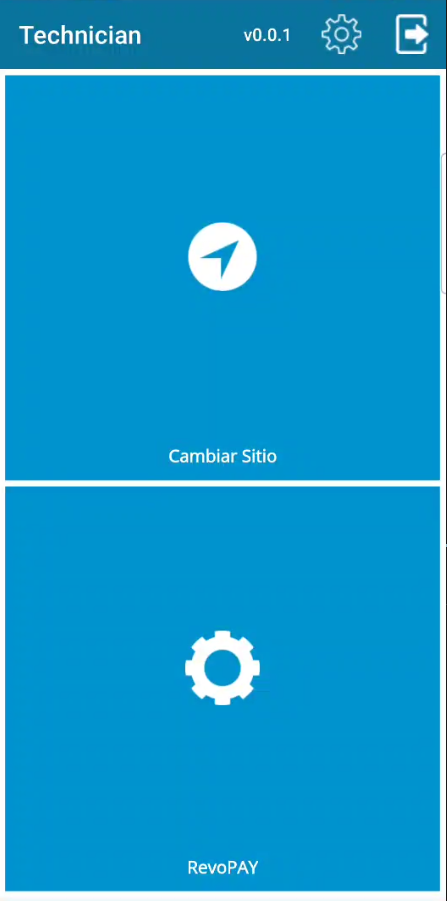

  

En la página de **HomeView**, encontrarás diferentes opciones. 
En la barra superior, podes ver el número de versión de la aplicación, un botón de **Settings** y un botón de **Cerrar Sesión**.
Luego, hay dos menús principales :   

**Cambiar Sitio** Le permitirá al técnico elegir un sitio diferente de la misma Red ya seleccionada.  
**RevoPAY** Lleva al técnico a un **Escáner Bluetooth** para conectarse con la RevoPAY y realizar cualquier configuración necesaria.
  

 

### Cerrar Sesión

El botón Cerrar Sesión te llevará de regreso a la vista de **Login** y olvidará tanto el usuario utilizado para iniciar sesión como los métodos de autenticación de tu dispositivo.

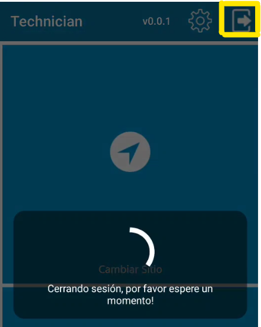

 

 

### Ajustes

    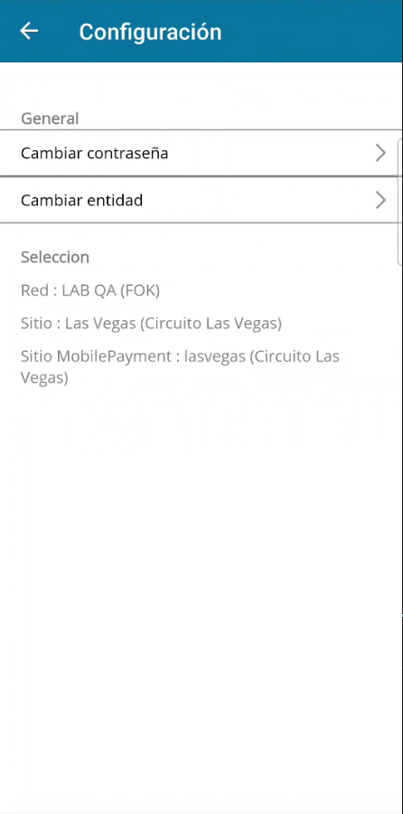
    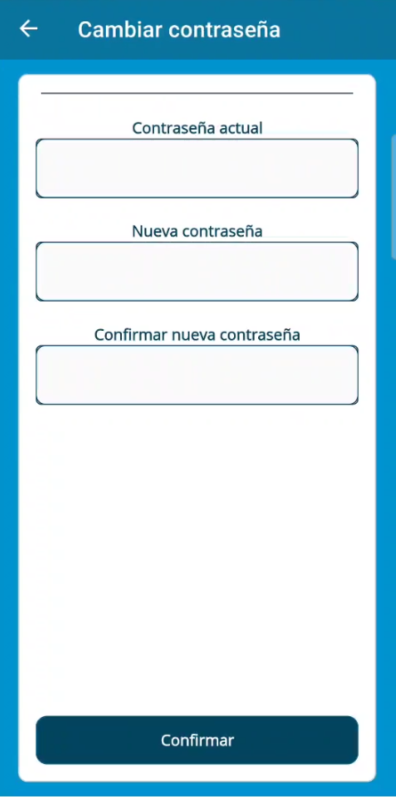
    
    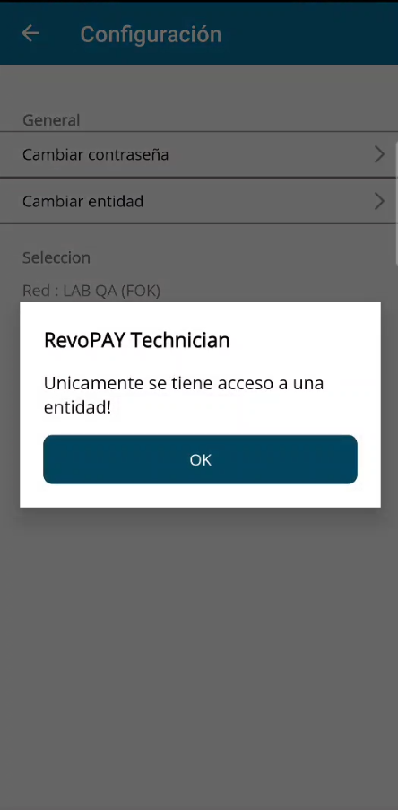

 

En el menú de **Ajustes** de **HomeView**, podes ver la Red que seleccionaste, así como el sitio de Ationet y el sitio de MobilePayment con el siguiente formato: Código(Nombre).

Aparte de eso, hay dos opciones:

* **Cambiar Contraseña**, que te llevará a una página para crear una nueva.
* **Cambiar Entidad**, que te llevará de regreso al selector de entidades si tu usuario tiene más de una entidad para elegir. De lo contrario, mostrará un mensaje que indica que solo tienes una entidad disponible.

 

## RevoPAY

  

  

Hasta este punto, toda la configuración realizada está directamente relacionada con Ationet o MobilePayment. Redes, Sitios, Credenciales, etc.  
El módulo de RevoPAY está destinado a que el técnico configure una RevoPAY nueva o una ya instalada.  
Solo se necesitan dos cosas.  
    1) La RevoPAY debe estar enchufada. 
    2) El técnico debe estar cerca de la RevoPAY para establecer una buena comunicación Bluetooth.   
     De lo contrario, fallará al conectarse o al enviar/recibir información.
  

 

### Escáner Bluetooth 

  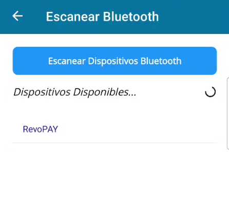

  
 Una vez que entres en el módulo RevoPAY, encontrarás un **Escáner Bluetooth**. Después de presionar **Escanear Dispositivos**, deberás darle a la aplicación ciertos permisos relacionados con Bluetooth para que el escáner funcione.   
Después de unos segundos, debería poder detectar la RevoPAY. Si no aparece, intenta re-ingresar al escáner y escanear de nuevo, y si eso también falla, reinicia la RevoPAY (desenchúfala y voelve a enchufarla).  Para conectarte, simplemente selecciona la RevoPAY!
  

 

## Menú General de RevoPAY 

  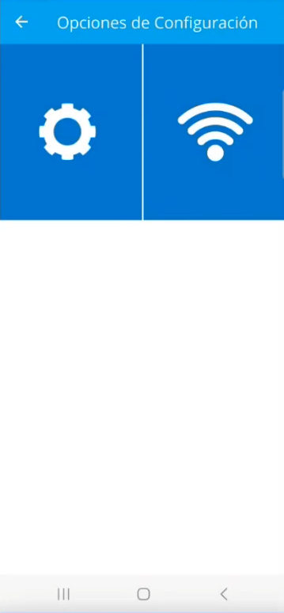

  

Después de establecer la conexión con RevoPAY, el técnico será redirigido a un Menú de Configuración General para RevoPAY, donde puede acceder a las opciones principales:  
**Configuración de Wifi**  
Donde el técnico podrá verificar si la RevoPAY tiene conexión WiFi y, si no la tiene, conectarlo a una **Red WiFi**.
      
**Configuración de Appsettings**  
Donde el técnico podrá modificar el archivo **appsettings** de RevoPAY según sea necesario.
  

 

 

## Configuración de Wifi para RevoPAY

    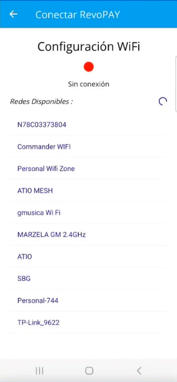
    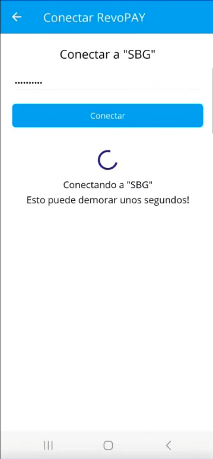
    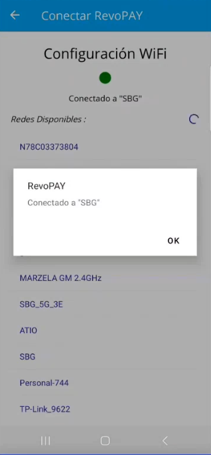

 

En el módulo de Wifi para RevoPAY, hay un botón tipo LED que indica si tiene conexión (rojo = SIN CONEXIÓN / verde = CONECTADO). También hay una lista que muestra todas las redes WiFi disponibles a las que RevoPAY puede acceder. Seleccione una, introduzca la contraseña, conectate, espera unos segundos, y listo! La conexión debería estar establecida.   Si después de un tiempo no se conecta, por favor, inténtalo de nuevo y verifica la contraseña ingresada.  

 

## Configuración de Appsettings para RevoPAY

    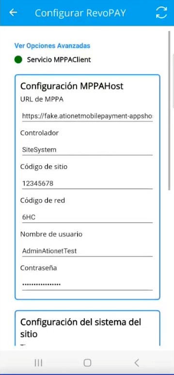
    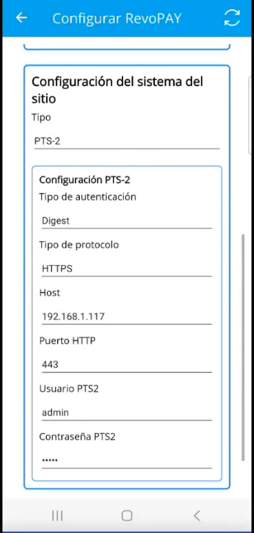
    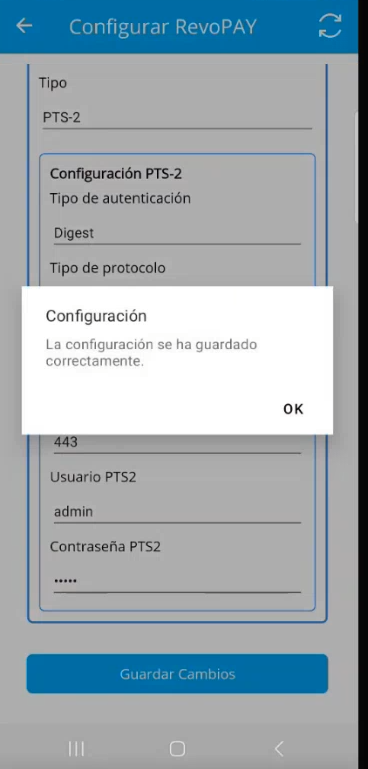

 

En la vista de **Appsettings** se podrá configurar todo lo necesario: **URL**, **Sistema de Sitio**, **Credenciales**, etc. **NO** podrás cambiar el Código de Sitio ni el Código de Red, ya que estos se toman de las selecciones anteriores. Si necesitas cambiarlos, ingresa a **HomeView > Ajustes > Cambiar Entidad** para el Código de Red o a **HomeView > Cambiar Sitio** para el Código de Sitio.
  
Las **Credenciales de MPPAHost**, por otro lado, son configurables. Recomendamos usar las credenciales genéricas, que están aseguradas de ser válidas! 
recordá: Admin{CódigoDeSitio}, Pass{CódigoDeSitio}
  
Hay un botón tipo LED que indica si el servicio **MPPAClient** está en funcionamiento. No si RevoPAY funciona correctamente, solo si esta corriendo el servicio.
 
También hay un botón de opciónes avanzadas que habilita otros campos para ser completados, como **timeouts** o configuraciones de **blob**.
  
En el menú de **Configuración del Sistema de Sitio**, podrás seleccionar qué tipo de **Sistema de Sitio** usar, como **PTS-2** o **Nano-CPI**.
 
Cada una de estas opciones mostrará la configuración extra necesaria acorde.
 
 
Finalmente, un botón **Guardar Configuración**, que actualizará el **appsetting** del servicio **MPPAClient** a través de Bluetooth según lo configurado por el técnico.

 

*Fin del documento*